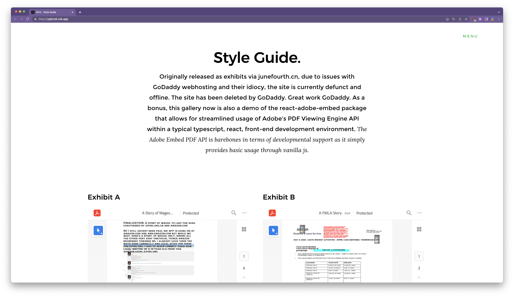

[](https://wakatime.com/badge/user/e012350f-8b4a-4ec4-ae89-56e558bfec5d/project/91c0617a-04ed-419d-9221-d5086d1bfbf6)  

# react-adobe-embed

 
## [React based ADOBE PDF EMBED API Component Facade](https://ziping-liu-corporation.github.io/react-adobe-embed/) is a Great Tool for Displaying PDF's with rich features,

Ziping Liu really enjoys using Adobe Acrobat DC Pro ever since having the chance to use it for the first time when I interned at a law firm. In case you want to use it with React with a bit more Typescript This Wrapper allows Adobe PDF Embed to work great with React 18 and Typescript

## Run a live Demo in your Browser:
-  View a running demo as editable code, showcasing PDF embed displays such as light box here via codesandbox: [codesandbox.io](https://codesandbox.io/p/sandbox/react-adobe-embed-pdf-galleria-showcase-yq5zz6?embed=1)
  <a href="http://awsretaliatory.com/"></a>
### Quick Guide
`npm install react-adobe-embed@10.29.23`

#### 1. Add this in a React Component or in your main App.tsx return or render block. Don't feel frightened about the parameters, this is written using typescript so the props are typed and have comments.
```tsx
import React from 'react';
 
import ReactViewAdobe from 'react-adobe-embed'

const App = () => {
return(
  <ReactViewAdobe
    clientId="324caa2a91b84f688935436cd2d25217"
    title="A Story of Wages"
    url={"https://storage.googleapis.com/laotzu/awslegal/"
          + "notarized/EXHIBIT_"
          + "A_Story%20of%20WagesOFNONPAIDAges_encrypted_.pdf"}
    /**
     * This is required and must be unique because adobe devs are coupled like that
     */
    id="exhbit-a-pdf" 
    fileMeta={{
      fileName: "A Story of Wages"
    }}
    previewConfig={{
      defaultViewMode: "FIT_WIDTH",
      showAnnotationTools: false,
      showPageControls: false,
      showDownloadPDF: false
    }}
    style={{
      height: "50vh"
    }}
  />
) }
```

##### Lightbox Example 
```ts
import React from 'react';

import ReactViewAdobe from 'react-adobe-embed'

const App = () => {
    const [viewDocumentTriggered, setViewDocumentTriggered] = React.useState(false);
    return (
        <div>
            <button onClick={(e)=>{
                e.preventDefault();
                setViewDocumentTriggered(true);
            }}>
                View Document
            </button>
            <ReactViewAdobe
                triggerAdobeDCViewRender={viewDocumentTriggered}
                clientId="324caa2a91b84f688935436cd2d25217"
                title="A Story of Wages"
                url={"https://storage.googleapis.com/laotzu/awslegal/"
                     + "notarized/EXHIBIT_"
                      + "A_Story%20of%20WagesOFNONPAIDAges_encrypted_.pdf"}
            /**
             * This is required and must be unique because adobe devs are coupled like that
             */
            id="exhbit-a-pdf"
            fileMeta={{
                fileName: "A Story of Wages"
            }}
            previewConfig={{
              "embedMode": "LIGHT_BOX"
            }}
         
  />
        </div>
    )
}
```
#### 2. ~~As the current implementation of creating [LIGHT_BOX](https://acrobatservices.adobe.com/view-sdk-demo/index.html#/view/LIGHT_BOX/Bodea%20Brochure.pdf) embed pdf's is quite complicated~~, you can view a live code example of how to use LIGHT_BOX mode with react-adobe-embed [here](https://codesandbox.io/p/sandbox/react-adobe-embed-pdf-galleria-showcase-yq5zz6?file=%2Fsrc%2FSections%2FMain.tsx%3A65%2C79)

#### 3. Note on adobe sdk `<script>` tag:
 - You don't need to worry about handling outside script tags. The react wrapper handles any script downloading. Simple call the React Component as shown above.
 - ~~In the past it was this: `<script src='https://documentcloud.adobe.com/view-sdk/main.js'></script>` as instructed by their office docs.~~
   - ~~If you use this URL right now however: it will give you an error saying to update your PDF Viewer. I saw the error on Nov 28th myself and asked myself... This is an embed PDF viewer, i shouldn't need to update anything.~~
 - ~~Anyways, the URL has been updated above in step 1.~~
  - ~~Since I guess Adobe just likes to change the URL to whatever they want, you can find the correct URL to use to include their ADOBE MAGIC STUFF [here](https://developer.adobe.com/document-services/docs/overview/pdf-embed-api/).~~
  - I don't know why but the folks at Adobe decided to change the script URL, and then also change the global variable name used to store the Adobe api methods, this has ulimately caused this npm package as actually a broken useless wrapper... so why didn't anyone add to the [discussion board](https://github.com/ZIPING-LIU-CORPORATION/react-adobe-embed/discussions/1) to let me know? Seriously? Just literally next time say, hey idiot your code is broken. I won't be offended. It's just code dude.

  

## Testing

Given the increasing intricacy of this wrapper, it is imperative to safeguard the fundamental functionality from any potential disruption caused by new code alterations. At present, a rudimentary examination is conducted to verify the wrapper's capability to accurately display the PDF content while effectively handling asynchronous requests to the Adobe PDF Embed API.

`npm run test`

```bash
PASS  src/__tests__/base.test.tsx
  BasicRender
    ✓ should render the component (23 ms)
    ✓ should re-render the component when component props updated (18 ms)

Test Suites: 1 passed, 1 total
Tests:       2 passed, 2 total
Snapshots:   2 passed, 2 total
Time:        1.699 s
Ran all test suites.
```


# FAQS
### Why was this made?
  - We needed a utility for displaying PDF's but wanted to have more typescript and React involved with the displaying. This is part of LIU LLC's intermission phase ongoing in preliminary motions for setting up required framing for phase 4. These motions and phases encompass research and analysis as well as press reporting of the ongoing retaliation campaign currently waged against an employee at Amazon that started April of 2022. To learn more, see [here](https://awsuni.com/life);
### Do you need to see a demo without code sandbox?
 - Okay, you can see a demo [here](https://twitterliu.com/linkedin) or [here](https://twitterliu.com/fmla) for now.
### Have something to say about this wrapper?
 - [Discuss Issues with it Here](https://github.com/ZIPING-LIU-CORPORATION/react-adobe-embed/discussions/1)
 - Or open up a pull request, it can be for any reason there's no required level of issue.
### Is this Wrapper Adobe Embed Thing being Updated? It's pretty barebones and doesn't do anything 
 - Yes, since this wrapper is actrively used in LIU LLC Sites, it is being updated and expect more updates and stuff on it
### Why are you using React 18? Why are you using Typescript 4.8? Isn't that overkill?
 - In some cases it is overkill, so hence you may utilize [Adobe Embed API](https://developer.adobe.com/document-services/apis/pdf-embed/) that is the service, hence why this package is called a wrapper and not ADOBE API Library
### This wrapper is overkill as a package on npm, a four year old could just write this out inline on any react front-end website
 - We agree, this is for those who are younger than four years old and not yet able to inline out components as vanilla react-js
### Where is npm?
 - You may view [here](https://www.npmjs.com/package/react-adobe-embed) for its npm package.
### Are you or is this wrapper thing affialated with Adobe Developer or Adobe?
```
Adobe, with its renowned symbols such as Acrobat, the Adobe PDF insignia, Adobe Premiere, Creative Cloud, InDesign, and Photoshop, are acknowledged trademarks of Adobe, registered in the United States and/or other jurisdictions. Ziping Liu Corporation, a trademark registered in the United States, and LIU LLC, incorporated under the laws of the State of Texas, are also part of our respected portfolio. At this moment, we have no additional public declarations to make or inquiries to address on this matter.

Ziping LIU Corporation, overseeing Adobe code, is proud to unveil an innovative Nested React Component, aptly named 'ReactViewAdobe'. This component is a result of careful engineering, designed with the specific aim of managing the API calls and configurations associated with the Adobe Embed API SDK. This component, in its profound wisdom, employs React Hooks, thereby transforming what the Adobe Embed API SDK perceives as static and unadorned JavaScript code into an elegantly transposed representation in the Document Object Model (DOM). This is a testament to our commitment to innovation and growth in the ever-evolving digital landscape, or alternatively, necessary code scaffolding to allow for Adobe's complex API to function properly in modern frameworks.
```
